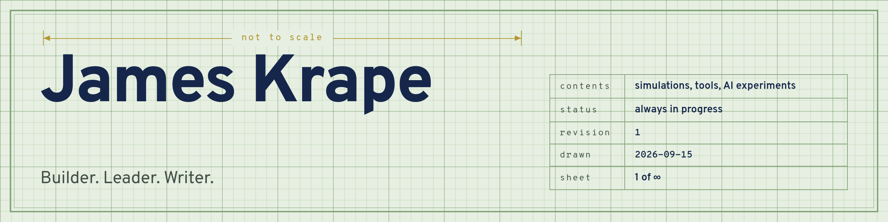
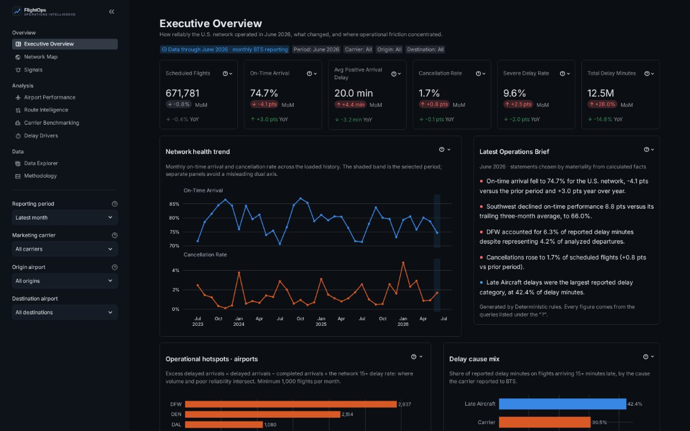
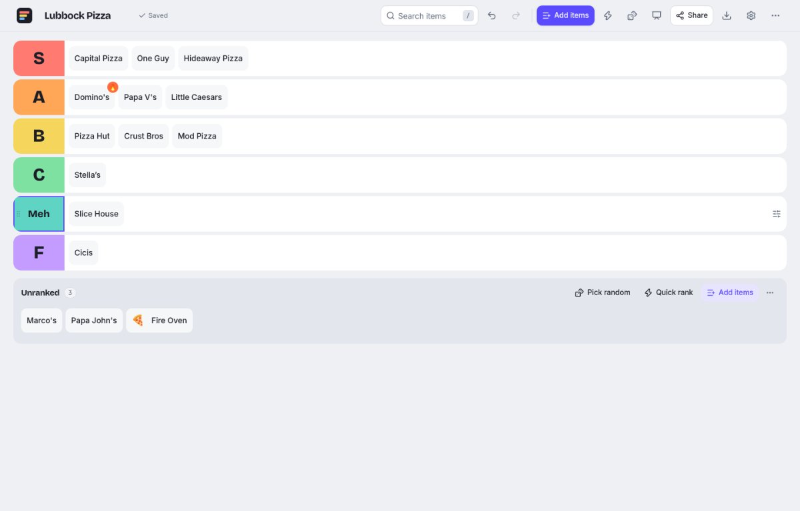
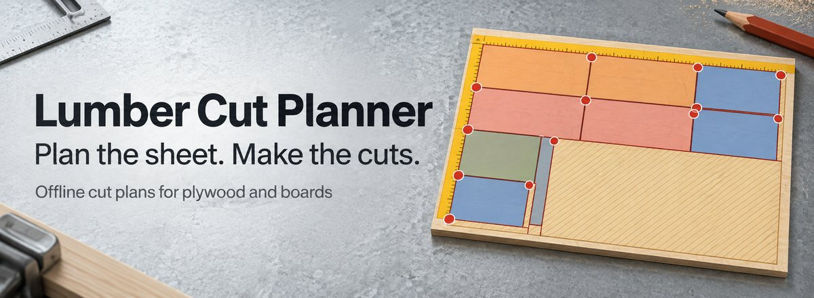
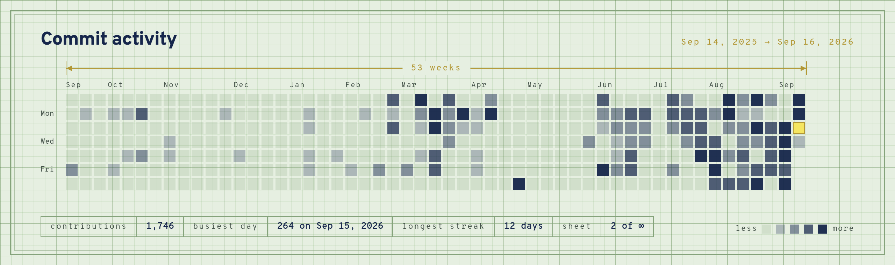

<!--
  Profile README for github.com/jameskbb. Hand-curated on purpose.

  To feature a project: copy one of the blocks under "Projects". The most
  substantial projects get a full-width block; smaller ones sit in the
  two-column table. Images live in assets/ (JPEG, ~1200px wide).

  Two regions are generated and must not be hand-edited -- anything between
  BEGIN:repos / END:repos and BEGIN:writing / END:writing is overwritten by
  scripts/update-readme.mjs on every workflow run. A repo linked anywhere above
  the repos marker counts as featured and is dropped from the generated list, so
  promoting something is just a matter of writing a block for it. To keep a repo
  off the page entirely, add its name to .github/readme-ignore.txt.

  Both sheets are generated too: assets/src/banner.html is sheet 1 and
  assets/src/activity.html is sheet 2, rendered through headless Chromium with a
  palette copied from jameskrape.com. See assets/src/render-*.mjs.
-->

<picture>
  <source media="(prefers-color-scheme: dark)" srcset="assets/banner-dark.png">
  
</picture>

Data and analytics by day. The rest of the time I build data tools, AI experiments, things for the woodshop, and the occasional simulation that exists only because I wanted to know the answer.

The writing lives at **[jameskrape.com](https://jameskrape.com)**, including the longer stories behind these projects. The résumé lives on **[LinkedIn](https://www.linkedin.com/in/jameskrape)**.

## Projects

### [FlightOps Intelligence](https://github.com/jameskbb/airline-ops)

Public airline-performance data is rich and almost unusable: roughly 650,000 rows and 120 columns a month, with every interesting question sitting several transformations away from the source. FlightOps turns 36 months of DOT on-time reporting — 22.9 million flights — into something you can actually interrogate, from network health down to a single route, carrier or delay cause. Each metric is defined once and compared like with like, so a genuinely bad month and a changed traffic mix stop looking the same. The processed data ships with the repo, so it runs the moment you clone it.

**[Source](https://github.com/jameskbb/airline-ops)**&emsp;`Streamlit` `DuckDB` `Parquet` `analytics` `Python`

### [Fly Golf](https://github.com/jameskbb/fly-golf)

Fly Golf takes the reconstructed wiring of a real fruit fly's brain (166,700 neurons, 25.6 million connections), simulates it spike by spike, and puts it on a 3D golf course. The fly picks a club from a full bag, lines up the shot and swings, with each decision read out of its neural activity. It hasn't broken 100 yet.

**[Live demo](https://jameskbb.github.io/fly-golf/)**&emsp;[Source](https://github.com/jameskbb/fly-golf)&emsp;`connectome` `spiking neural sim` `Three.js` `Python`

<table>
<tr>
<td width="50%" valign="top">

### [Tierboard](https://github.com/jameskbb/tierboard)

Someone at lunch says "let's rank every pizza place in town." Paste a list, drag it into tiers, share a link — fast enough to finish before the conversation moves on. Voting, presentation mode and PNG export stay a keystroke away. No login, no backend.

**[Live demo](https://jameskbb.github.io/tierboard/)**&emsp;`TypeScript` `no backend`

</td>
<td width="50%" valign="top">

### [Lumber Cut Planner](https://github.com/jameskbb/lumber-cut-planner)

Tell it the plywood and boards you have and the parts you need. It lays out cuts a table saw can actually make, edge to edge with the blade kerf taken out, numbers them in the order you'll make them, and points out the offcuts worth keeping. It runs offline in a phone browser.

**[Live demo](https://jameskbb.github.io/lumber-cut-planner/)**&emsp;`woodworking` `cut optimization` `offline web app`

</td>
</tr>
<tr>
<td width="50%" valign="top">

### [Blink Light](https://github.com/jameskbb/blink-light)

A USB light that knows what my day is doing. It glows red while I'm in a meeting, flashes gold two minutes before standup, breathes blue when an AI coding agent finishes, and thumps orange when a CI run fails.

`Python` `hardware` `AI agents`

</td>
<td width="50%" valign="top">

### [My homelab](https://github.com/jameskbb/homelab-public)

A retired office desktop running Proxmox with three jobs: everyday apps, game servers for friends, and a sandbox for experiments. Written as a guide for someone who has never run a server, backups and restores included.

`Proxmox` `self-hosting` `guide`

</td>
</tr>
</table>

## Elsewhere on GitHub

<!-- BEGIN:repos -->
_Everything public is featured above. Anything new lands here on its own._
<!-- END:repos -->

## Writing

<!-- BEGIN:writing -->
I write at **[jameskrape.com](https://jameskrape.com)** — notes on systems, analytics and whatever I'm building.

This section fills itself in once the site publishes a feed.
<!-- END:writing -->

## Activity

<picture>
  <source media="(prefers-color-scheme: dark)" srcset="assets/activity-dark.png">
  
</picture>
